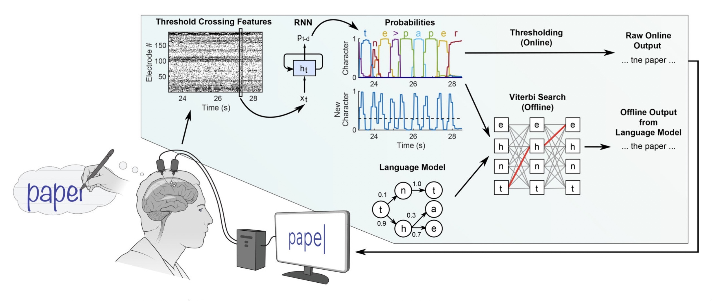
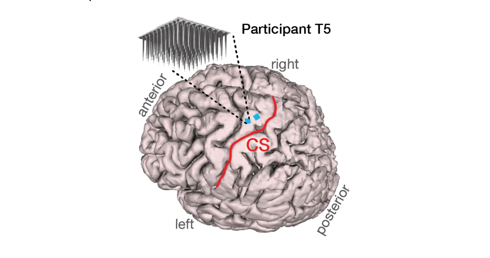

NeuralText - 🚧 WORK IN PROGRESS 🚧
================

<!-- WARNING: THIS FILE WAS AUTOGENERATED! DO NOT EDIT! -->

Paper: [High-performance brain-to-text communication via
handwriting](https://www.nature.com/articles/s41586-021-03506-2)

I’m currently working towards this paper. Check out my learning progress
here: https://twitter.com/xariusrke/status/1621403313651728386

### The Dataset

### TODO

- Generate synthetic sentences
- Create snippet template for each character
- Create a Dataset class for sentences
- Labelling sentence data
